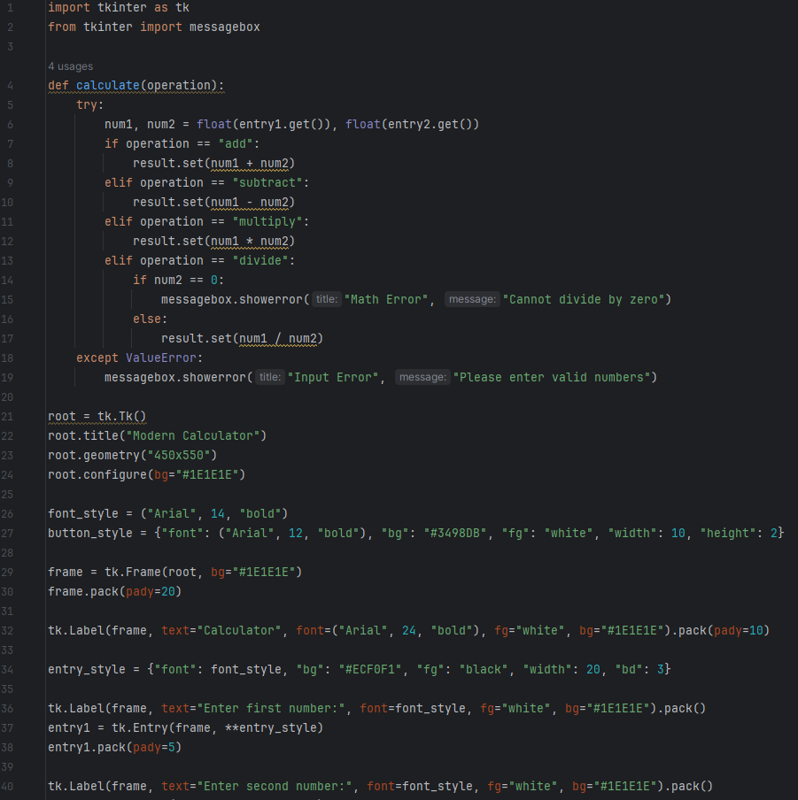
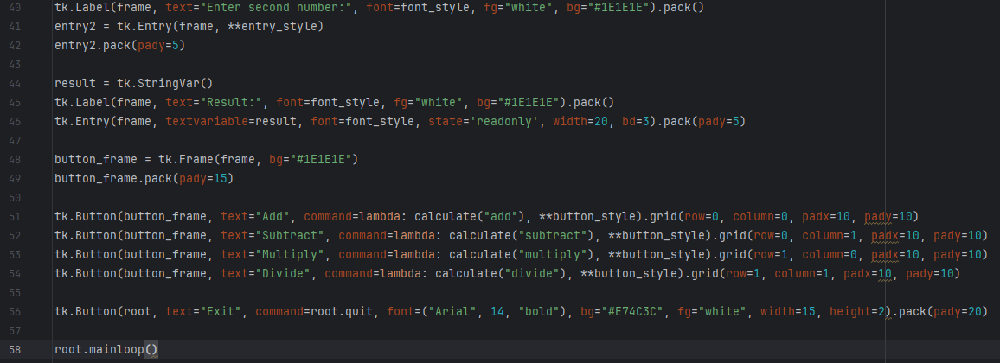
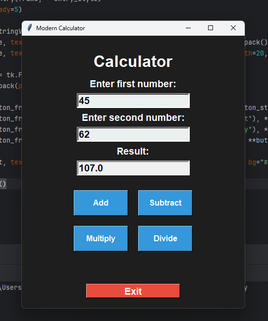

<div align="center">

# 🧮 Calculator Python App — Desktop GUI Calculator

> A clean, modern desktop calculator built with Python and Tkinter, featuring a dark-themed user interface with four core arithmetic operations and robust input validation.

🎬 **Watch the Demo Video — Calculator Python App:** [Google Drive Demo Video](https://drive.google.com/file/d/1YKy2b5pm6q43Gj_qSjd8WZmURCqEq7IM/view?usp=drive_link)

[](https://www.python.org/)
[](https://docs.python.org/3/library/tkinter.html)
[](LICENSE)

</div>

---

## 🌟 Overview

The **Calculator Python App** is a beginner-friendly, Tkinter-based graphical desktop calculator built as part of a structured Python learning. The application presents a polished dark-mode user interface where users enter two numbers and instantly compute their sum, difference, product, or quotient — all while handling errors like division by zero and non-numeric input gracefully.

This project was developed to reinforce fundamental Python concepts such as:
- Variables and dynamic typing
- User input & output handling
- Type conversion (string → float)
- Conditional logic and error handling
- Building GUI applications with the built-in `tkinter` library

---

## 📸 Screenshots

### Main Application Window
<p align="center">
  
</p>

### Arithmetic Operation Results
<p align="center">
  
</p>

### Error Handling
<p align="center">
  
</p>

---

## ✨ Features

- **➕ Addition**: Instantly adds two floating-point numbers.
- **➖ Subtraction**: Returns the precise difference between two values.
- **✖️ Multiplication**: Computes the product of any two numbers.
- **➗ Division**: Divides the first number by the second with full zero-division protection.
- **🛡️ Input Validation**: Displays a descriptive error dialog (`messagebox.showerror`) if:
  - The user enters non-numeric text (e.g. letters or symbols).
  - The user attempts to divide by zero.
- **🖤 Dark Mode UI**: Custom dark background (`#1E1E1E`) with white labels and blue action buttons for a modern, premium appearance.
- **📌 Read-Only Result Field**: The result is displayed in a locked, read-only entry field to prevent accidental edits.

---

## 🛠️ Tech Stack

| Component | Technology |
| :--- | :--- |
| **Language** | Python 3.8+ |
| **GUI Framework** | `tkinter` (Python Standard Library) |
| **Error Dialogs** | `tkinter.messagebox` |
| **IDE** | PyCharm |

---

## 📁 Project Structure

```
Calculator-Python-App/
│
├── CalculatorApp.py      # Main application file — GUI layout & arithmetic logic
├── 1111.docx             # Project documentation with screenshots & activity log
├── screenshots/
│   ├── screenshot_1.png  # App window with addition result
│   ├── screenshot_2.png  # Main calculator UI
│   ├── screenshot_3.png  # Division operation result
│   └── screenshot_4.png  # Error dialog for invalid input
└── README.md
```

---

## ⚙️ How It Works

```
User enters two numbers into the input fields
             ↓
Clicks one of four operation buttons:
  [Add] [Subtract] [Multiply] [Divide]
             ↓
calculate(operation) function fires:
  - Reads both entry fields as float values
  - Performs arithmetic based on operation
  - Writes result to the read-only result field
             ↓
Error cases:
  - Non-numeric input  → "Input Error" dialog
  - Division by zero   → "Math Error" dialog
             ↓
Click [Exit] to close the application
```

---

## 🚀 Getting Started

### Prerequisites
- **Python 3.8** or higher (Tkinter is included by default in standard Python installs)
- **PyCharm** (optional, any Python IDE or terminal will work)

### Run the Application

**1. Clone the Repository:**
```bash
git clone https://github.com/AnasQ2003/Calculator-Python-App.git
cd Calculator-Python-App
```

**2. Run the App:**
```bash
python CalculatorApp.py
```

The calculator window will launch immediately — no extra dependencies or package installation required!

---

## 💡 Key Concepts Demonstrated

| Concept | How It's Used |
| :--- | :--- |
| **Variables & Types** | `num1`, `num2` as floats; `result` as a `StringVar` |
| **User Input** | `tk.Entry` widgets to accept number inputs |
| **Type Conversion** | `float(entry.get())` converts string input to numeric |
| **Conditional Logic** | `if/elif` chain for operation routing and zero-check |
| **Exception Handling** | `try/except ValueError` for non-numeric inputs |
| **GUI Widgets** | `Frame`, `Label`, `Entry`, `Button` from tkinter |
| **Grid Layout** | `.grid(row, column)` for the 2×2 button arrangement |

---

## 🧠 Learning Objectives

> ✅ **Objective**: Introduce Python's basic syntax, variables, data types, and arithmetic operations while building familiarity with user interaction and GUI programming.

**Activities Completed:**
- ✔️ Learned about Python variables and dynamic typing.
- ✔️ Explored data types: integers, floats, and strings.
- ✔️ Practiced taking user input and displaying output.
- ✔️ Applied basic arithmetic: addition, subtraction, multiplication, division.
- ✔️ Built a fully functional GUI calculator using the Tkinter standard library.

**Key Takeaways:**
- Syntax correctness is crucial in Python execution.
- Input/Output functions form the basic interaction between user and program.
- Data type conversion (string → float) is critical for numeric computation.
- GUI frameworks like Tkinter make desktop applications approachable for beginners.

---

## 📄 License

```
MIT License

Copyright (c) Calculator Python App --- 2026 AnasQ2003

Permission is hereby granted, free of charge, to any person obtaining a copy
of this software and associated documentation files (the "Software"), to deal
in the Software without restriction, including without limitation the rights
to use, copy, modify, merge, publish, distribute, sublicense, and/or sell
copies of the Software, and to permit persons to whom the Software is
furnished to do so, subject to the following conditions:

The above copyright notice and this permission notice shall be included in all
copies or substantial portions of the Software.

THE SOFTWARE IS PROVIDED "AS IS", WITHOUT WARRANTY OF ANY KIND, EXPRESS OR
IMPLIED, INCLUDING BUT NOT LIMITED TO THE WARRANTIES OF MERCHANTABILITY,
FITNESS FOR A PARTICULAR PURPOSE AND NONINFRINGEMENT.
```

---

## 👨‍💻 Author

**Anas Ahmed Qureshi.** — [@AnasQ2003](https://github.com/AnasQ2003)

---

<div align="center">
  <p>Built with ❤️ by <strong>Anas</strong></p>
  
 <div align="center">

Made with 💧 and a lot of ☕

**⭐ If you found this useful, please star the repository!**

</div>
